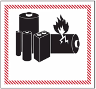

# Antique inspired candlestick holder

This project started with a restoration and modernization to an antique candlestick holder
that my grandfather made. I adoped some of the design elements as an homage to his work,
but used a style all my own. The sections below detail each aspect required to build your
own copy and a bit more about the history for those interested.

## Electrical components

 **DANGER**: Lithium Ion batteries can get hot
and cause a fire!

The battery and charger used are specified to detect short conditions and overheading, but
always use caution when working with these devices!

The design choices were influenced by size and common availability. Everything is available
through Amazon, maybe other channels. The electrical components are [here](electrical.md)

The LED bulb uses a standard 12v G4 socket. There is a charger for the single LiPo cell
and a DC to DC converter to boost the battery voltage to 12v.

## 3D models

There are [six 3D printed parts](3D-cad/parts.md), designed using [OpenSCAD](https://openscad.org/).
All of the designs are my original work and I'm not a mechanical designer, so don't be
too hard on me if the models aren't great!

The parts were printed using a Prusa Research i3 MK3S using PrusaSlicer. I tend to make
models with tight clearances and sand as necessary. The inside of the bulb needed a
bit of work to make the LED fit. There isn't enough thickness to make the inside
bigger without getting into the threads. Hand filing the inside diameter was the best
solution I found.

The bulb is printed in Prusament PETG Prusa Orange transparent. The base and cup are
printed in Panchroma PLA Silk Brass. The candle, charge plate, and latch are printed in
Amolen PLA+ Paper White.

## Assembly

The candle has 14 individual parts, with assembly instructions [here](assembly/assembly.md)

## More about the history and design

In the house where I grew up, as you entered through the front door you stood in a foyer.
Towards the other end, by the hallway leading to the bedrooms, was a small round table.
On the table was a nightlight, hand crafted by my grandfather, that resembled a
candlestick holder with a candle and a neon flicker bulb on top. He likely cast the
intricate brass base piece in his basement. The family moved out of that house and in the
process of moving (multiple times), the candle holder was damaged. The handle was broken
off the base and into two pieces. Eventually the candle and electrical parts were lost.
My sister suggested that without the original parts, maybe I could make something to
replace them. The project became somewhat like what the car world calls a "restomod."
The idea being you preserve the antique style and as much of the original as makes sense
(restore), but use modern parts for the engine, brakes, handling, and so forth (modify).
In the case of an antique electric candle, that means a rechargeable battery and an LED
flicker bulb are basic requirements.

When grandad made his candle, he didn\'t make a cup. The white candle tube went all the
way to the base, with an electrical cord coming through a cutout at the bottom. My candle
design is the same form factor as a standard 7/8 in. (22mm) taper candle, which requires a
cup feature. Researching the design in different periods led to see that grandad was a
fan of the 18th Century Victorian style. The beaded ring feature is from that period and
was kept in the cup design to echo the base. The base I designed kept the beaded ring
feature, but has a simple flower theme instead of the intricate filigree of the original.
The bees in the corners follow the flower theme and also remind me that grandad kept bees.

The design of the candle constrained to the "correct" dimensions was a little challenging.
The LiPo battery cell just fits nicely with room on each side for the required wires to
pass. Finding a charger module and DC to DC module that fit inside the body of the candle
was great. Using off the shelf parts instead of designing from scratch is quite a savings
in time, effort, and cost.
