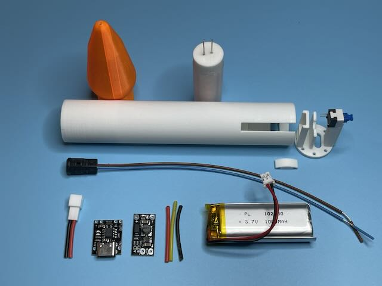
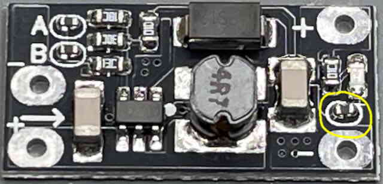
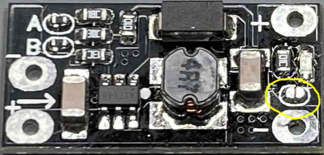
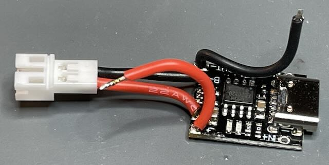
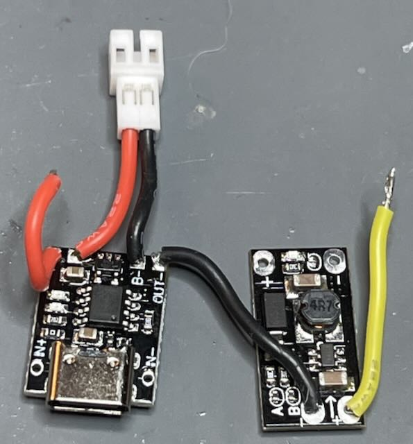
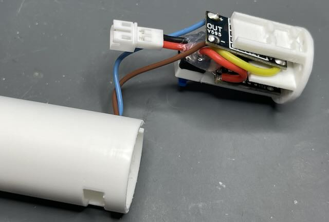
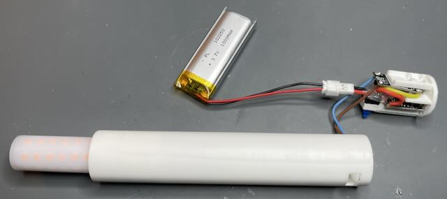
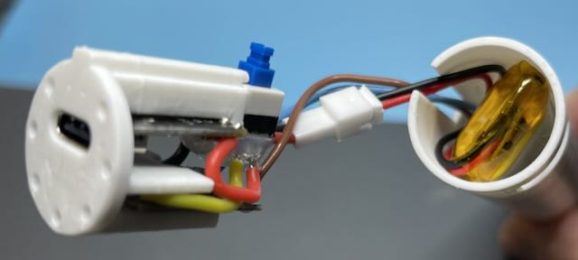
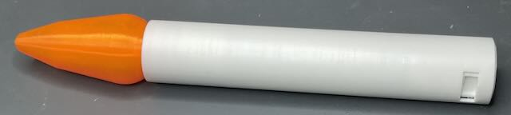
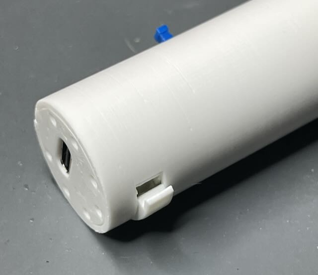

# How to assemble the candle

## These are the parts you will need

* 3D printed bulb
* LED bulb
* Candle
* Charge plate
* Switch
* Latch
* G4 socket
* JST socket
* USB charger
* DC-DC converter
* 30mm Red silicone wire
* 30mm Yellow silicone wire
* 30mm Black silicone wire
* 1000maH battery

## Step 1 - Modification of the DC-DC module (optional)
This module has an LED indicator when it is powered. If you don't want to have the LED
shining inside the candle, a simple rework disables it. Remove the resistor next to the
negative output pad. NOTE: You can mechanically remove the resistor with a flush cutter
or knife if you are careful.

### Unmodified:

### Resistor removed:

## Continue assembly with the steps below:

### Step 2- Solder the JST socket to the USB charger module as well as the Red and Black wires.

### Step 3 - Solder the DC-DC converter input wires.

### Step 4 - Insert the G4 socket as shown.

The socket needs enough slack to allow securing it with glue below. Bending the wires into
an "S" shape will help to take up the slack in the wires as the charge plate is attached.

### Step 5 - Attach switch

Use superglue to attach the switch to the charge plate, being careful to align the body
with the post.

### Step 6 - Install boards

Start with the DC-DC converter board.

Then position the USB-C connector in the charger plate and snap the board into the post.

### Step 7 - Wire the switch

### Step 8 - Glue the G4 socket

Holding the socket out of the way (and not getting burned!), squirt a blob of hot glue
into the socket hole and quickly push in the socket and seat it.

### Step 9 - Hot glue switch

Use hot glue to cover the switch posts, the JST wires, and the top of the USB charger module.

### Step 10 - Wire the G4 socket

Solder the Brown and Blue wires to the DC-DC converter module. Note that the colors don't
matter, the socket and LED bulb don't have a required polarity.

### Step 11 - Try it out!

Insert the LED bulb into the socket and attach the battery. Turn the switch on and off
a few times to ensure it is working.

### Step 12 - Route the wires

Holding the wires to the side with the cutout, insert the battery as shown. The wires
should be on one side, along with the JST connection. Note the "S" bend in the G4
socket wire will help take up the slack when inserting the charge plate.

### Step 13 - Insert the charge plate

Slide the charge plate post along the candle cutout until the bottom of the charge plate
is flush with the bottom of the candle. The charge plate slot should line up with the
latch plate slot in the candle.

### Install the latch

Install the latch starting with one side to make sure the slots are aligned. Note: Make
sure the slots don't have leftover filament blobs and printed the proper size. Otherwise
it might not be possible to install the latch.

